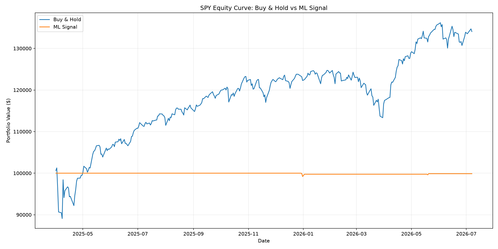
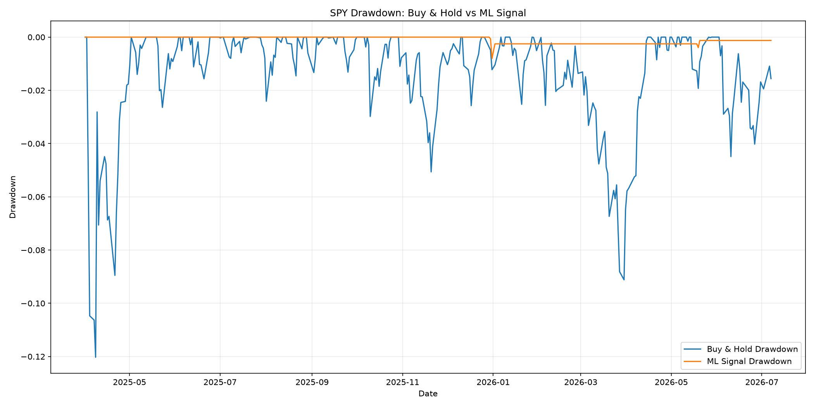
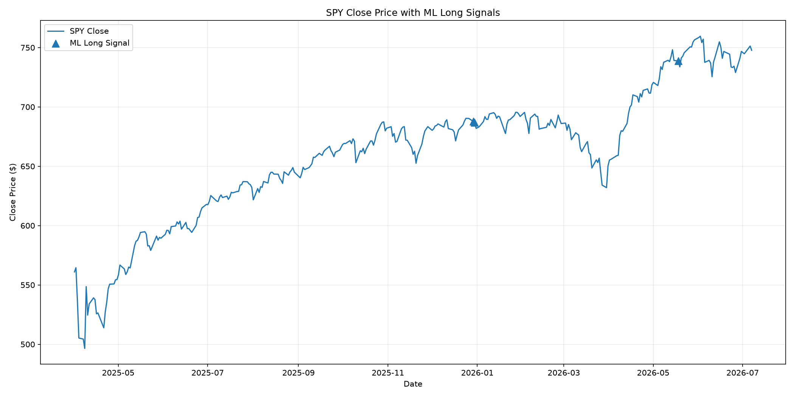
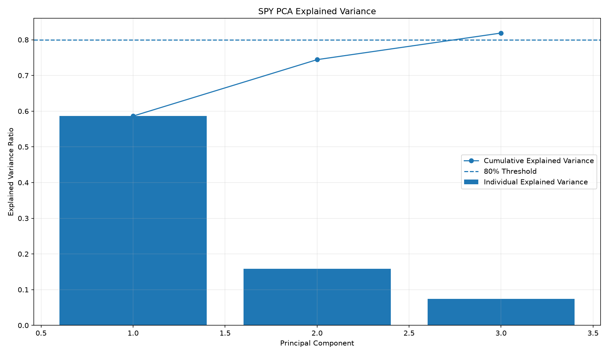
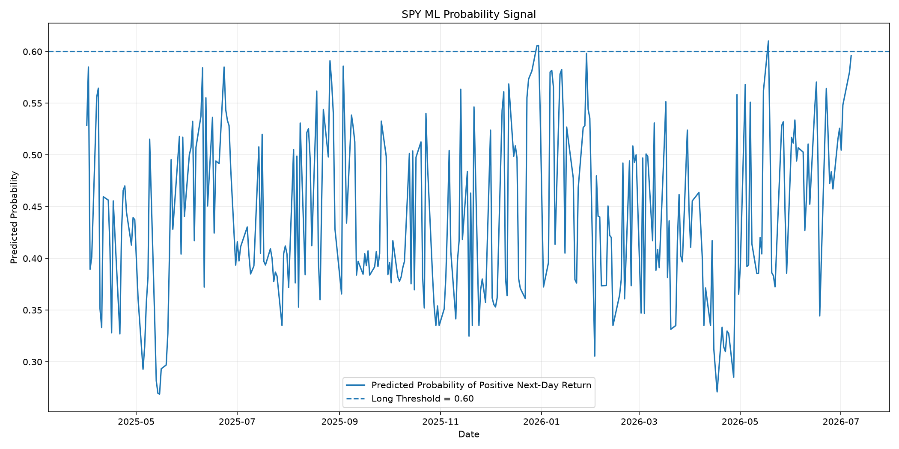
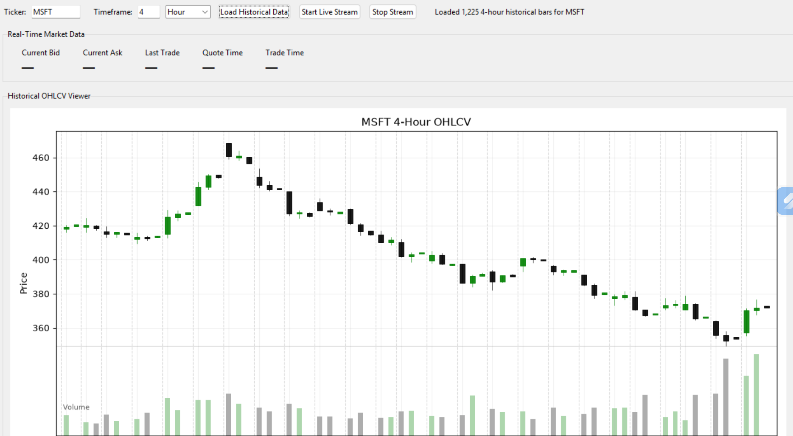
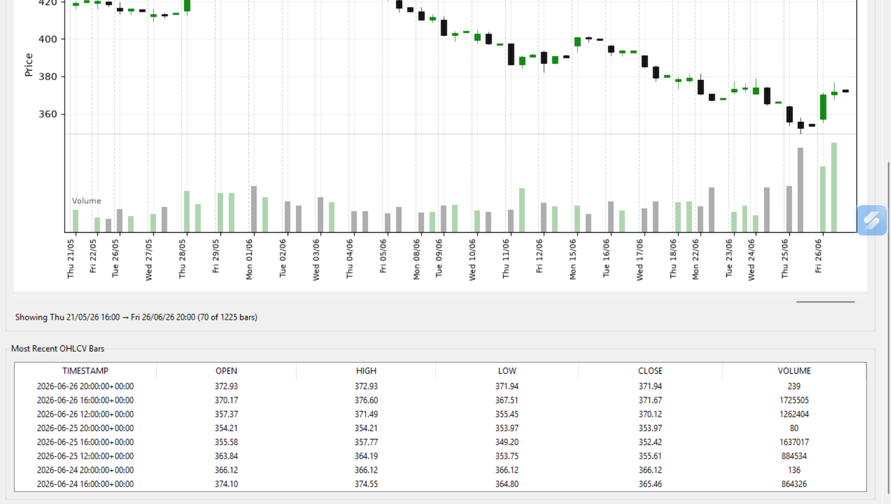
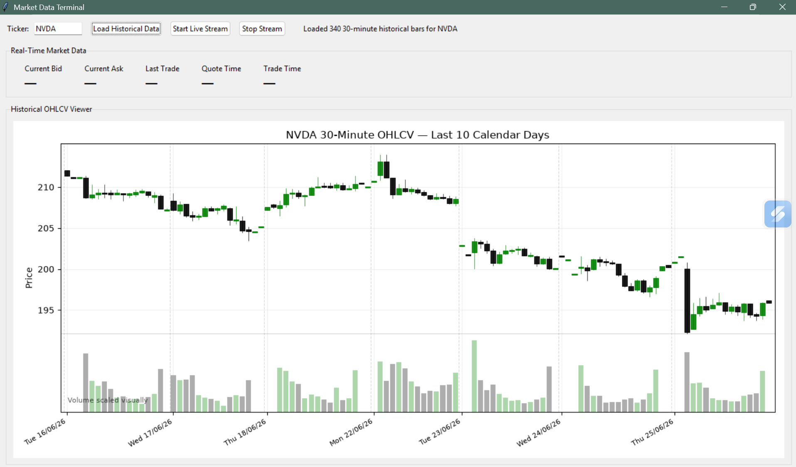
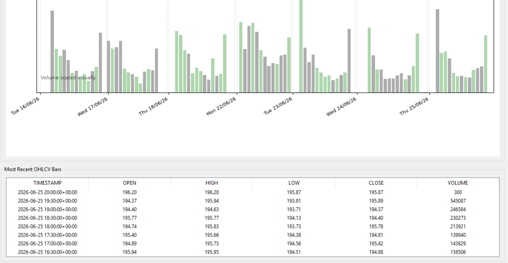

# Market Data Terminal + Strategy Backtesting Platform

A Python market data and algorithmic trading research project built with Alpaca, Pandas, NumPy, scikit-learn, Matplotlib, and Tkinter.

This project has four main parts:

1. **Market Data Terminal**  
   A desktop Tkinter application that connects to Alpaca, downloads historical OHLCV data, streams real-time bid/ask quotes and last trade prices, and displays candlestick-style charts.

2. **Technical Indicator Strategy Backtester**  
   A reusable backtesting workflow for FINM-25000. It downloads historical daily OHLCV data from Alpaca, computes technical indicators, compares multiple long-only strategies, generates charts, calculates performance metrics, and produces a final PDF report.

3. **Machine-Learning Trading Pipeline**  
   A machine-learning workflow that downloads fresh Alpaca daily OHLCV data, engineers technical-indicator features, applies PCA, trains a Random Forest classifier, generates probability-based long/flat signals, backtests the ML strategy, compares it against Buy & Hold, and saves metrics/charts/artifacts.

4. **Alpaca Paper-Trading Demo**  
   A paper-trading script that loads a saved ML model bundle, downloads fresh market data, rebuilds the latest feature row, applies the saved PCA transform, generates the latest ML signal, and optionally submits a paper order through Alpaca. This is paper trading only; no real money is used.

---

## Features

### Market Data Terminal

- Authenticates with Alpaca paper-trading credentials
- Loads API keys securely from a local `.env` file
- Downloads historical OHLCV bars
- Supports user-selected timeframes such as minute, hour, day, week, and month
- Displays the most recent chart window for readability
- Shows candlestick-style OHLCV data with volume bars
- Colors bullish candles green and bearish candles black
- Adds daily separators to make session boundaries easier to read
- Streams real-time bid/ask quotes
- Streams last trade prices
- Updates the UI automatically when new live market data arrives
- Organizes API, configuration, streaming, and UI logic into separate modules

### Technical Indicator Backtesting Platform

- Downloads 5+ years of daily OHLCV data from Alpaca
- Computes technical indicators
- Builds strategy entry and exit signals
- Runs long-only portfolio simulations
- Compares strategies against Buy & Hold
- Exports trades, portfolios, metrics, charts, and reports
- Includes a sample-data mode for testing without Alpaca credentials

### Machine-Learning Trading Pipeline

- Downloads fresh Alpaca daily OHLCV data for any user-selected symbol
- Uses the SIP data feed by default with a delayed end time to avoid recent-data subscription restrictions
- Engineers at least 6 features across trend, momentum, volatility, volume, return, and rolling-statistic categories
- Standardizes features and applies PCA
- Keeps enough principal components to explain at least 80% of feature variance
- Trains a Random Forest classifier to predict whether the next daily return is positive
- Converts model probability into a long-only signal
- Uses the rule: **Long if probability > 0.60, otherwise Flat**
- Backtests the ML signal against Buy & Hold
- Saves metrics, charts, train/test PCA files, test signals, round trips, and a model bundle

### Paper Trading

- Loads a saved model bundle from the machine-learning pipeline
- Downloads fresh Alpaca market data
- Rebuilds the latest feature row
- Applies the saved scaler and PCA transformer
- Generates the latest probability and long/flat signal
- Checks the current Alpaca paper position
- Submits a paper BUY/SELL order only when explicitly run with `--execute`
- Saves paper-trading decision logs for review and video explanation

---

## Tech Stack

- Python
- Alpaca-py
- Pandas
- NumPy
- scikit-learn
- Matplotlib
- Tkinter
- python-dotenv
- joblib
- Git / GitHub

---

## Project Structure

```text
alpaca_app/
│
├── app.py                          # Thin launcher for the Tkinter market terminal
├── run_backtest.py                # Original technical-indicator strategy backtest runner
├── run_ml_backtest.py         # Machine-learning + PCA backtest runner
├── run_signal_scan.py         # Multi-symbol latest-signal scanner
├── run_paper_trade.py         # Alpaca paper-trading demo runner
├── README.md
├── requirements.txt
├── .env.example
├── .gitignore
│
├── market_terminal/
│   ├── __init__.py
│   ├── config.py                  # Loads Alpaca credentials from .env
│   ├── constants.py               # Shared constants and defaults
│   ├── data_connector.py          # Alpaca historical data + paper account validation
│   ├── live_stream.py             # Alpaca websocket stream for terminal UI
│   ├── indicators.py              # SMA, EMA, MACD, ADX, RSI, Bollinger, ATR, OBV, CMF
│   ├── features.py                # Machine-learning feature engineering
│   ├── pca_transformer.py         # StandardScaler + PCA fitting/transform logic
│   ├── ml_model.py                # Random Forest model + probability signal logic
│   ├── strategies.py              # Technical-indicator strategy signal rules
│   ├── backtester.py              # Reusable long-only backtesting engine
│   ├── performance.py             # Risk/return metrics
│   ├── visualizations.py          # Charts
│   └── report.py                  # PDF report generator
│
├── screenshots/                   # Terminal UI screenshots
│
├── charts/
│   ├── AAPL/                      # Committed AAPL technical-strategy charts
│   └── SPY/                       # Committed SPY machine-learning charts
│       ├── spy_equity_curve.png
│       ├── spy_drawdown.png
│       ├── spy_ml_signals.png
│       ├── spy_pca_variance.png
│       └── spy_probability_signal.png
│
├── data/
│   ├── AAPL/                      # Committed AAPL metrics
│   └── SPY/                       # Committed SPY metrics and sanitized paper-trade logs
│       ├── spy_performance_metrics.csv
│       └── paper_trade_logs/
│           ├── spy_paper_trade_01_dry_run_buy_decision.json
│           ├── spy_paper_trade_02_paper_buy_order_submitted.json
│           ├── spy_paper_trade_03_position_confirmed_hold.json
│           └── spy_paper_trade_transition_summary.json
│
├── reports/                       # Optional manually copied reports
└── outputs/                       # Auto-generated run outputs; usually ignored by Git
```

---

## Setup Instructions

### 1. Clone the repository

```bash
git clone https://github.com/SimbaSimbiri/alpaca_app.git
cd alpaca_app
```

### 2. Create a virtual environment

```bash
python -m venv .venv
```

### 3. Activate the virtual environment

On Windows:

```bash
.venv\Scripts\activate
```

On macOS/Linux:

```bash
source .venv/bin/activate
```

### 4. Install dependencies

```bash
pip install -r requirements.txt
```

---

## API Key Setup

This project requires Alpaca API credentials.

Create a local `.env` file in the project root. Do not commit `.env` to GitHub.

```env
ALPACA_API_KEY=replace_me
ALPACA_SECRET_KEY=replace_me
ALPACA_DATA_FEED=sip
```

The machine-learning scripts also accept these common Alpaca environment variable names:

```env
APCA_API_KEY_ID=replace_me
APCA_API_SECRET_KEY=replace_me
```

The ML backtest and paper-trading scripts default to the Alpaca SIP feed and subtract 20 minutes from the latest timestamp by default. This avoids requesting very recent SIP data that may not be available on some Alpaca subscriptions.

---

## Running the Market Terminal UI

After setting up the virtual environment and `.env` file, run:

```bash
python app.py
```

Recommended tickers for testing:

- MSFT
- AAPL
- SPY
- QQQ
- NVDA
- TSLA

### How to Use the Terminal

1. Open the app with:

   ```bash
   python app.py
   ```

2. Enter a ticker symbol, such as `MSFT`, `AAPL`, or `NVDA`.
3. Select a timeframe.
4. Click **Load Historical Data**.
5. The chart displays recent OHLCV candlestick bars with volume.
6. Click **Start Live Stream**.
7. The real-time quote panel waits for live bid, ask, and last trade updates.
8. Click **Stop Stream** to stop the websocket stream.

### Historical Data Viewer

The terminal chart displays:

- Open, high, low, and close candles
- Green bullish candles where close is greater than or equal to open
- Black bearish candles where close is below open
- Volume bars beneath the candles
- Day separators at session boundaries
- A recent OHLCV table below the chart

The app downloads more data than it displays so the backend can work with historical data while keeping the UI readable.

### Real-Time Quote UI

The real-time quote panel displays:

- Current bid
- Current ask
- Last trade price
- Quote timestamp
- Trade timestamp

The live stream is event-driven, so the fields update when Alpaca sends new quote or trade events.

### Market Hours Note

Historical data can load outside regular market hours.

Real-time quotes and trades are easiest to observe during regular U.S. market hours. Outside market hours, the websocket may connect successfully but receive few or no quote/trade updates depending on the ticker, feed, and market activity.

---

## Running the Technical Indicator Backtest

Run with real Alpaca historical daily data:

```bash
python run_backtest.py --ticker MSFT --years 5
```

Other examples:

```bash
python run_backtest.py --ticker AAPL --years 5
python run_backtest.py --ticker SPY --years 5
python run_backtest.py --ticker QQQ --years 5
python run_backtest.py --ticker NVDA --years 5
```

Optional commission/slippage assumption:

```bash
python run_backtest.py --ticker MSFT --years 5 --commission 1.00
```

Local test without Alpaca credentials:

```bash
python run_backtest.py --ticker SAMPLE --years 5 --sample
```

The `--sample` flag is available for local verification; Alpaca data is used for the final results.

---

## Running the Machine-Learning Backtest

The machine-learning pipeline is run through:

```bash
python run_ml_backtest.py --symbol SPY
```

The command above downloads fresh Alpaca daily OHLCV data, builds ML features, applies PCA, trains a Random Forest classifier, generates long/flat signals, backtests the strategy, saves charts, saves metrics, and saves a model/PCA bundle for paper trading.

The default feed is SIP. The default data delay is 20 minutes.

Equivalent explicit command:

```bash
python run_ml_backtest.py --symbol SPY --feed sip --data-delay-minutes 20
```

Run another symbol:

```bash
python run_ml_backtest.py --symbol AAPL
python run_ml_backtest.py --symbol MSFT
python run_ml_backtest.py --symbol QQQ
```

Use custom dates:

```bash
python run_ml_backtest.py --symbol SPY --start 2021-07-01 --end 2026-07-01
```

Allow fractional shares in the backtest:

```bash
python run_ml_backtest.py --symbol SPY --allow-fractional-shares
```

Adjust the long-signal threshold:

```bash
python run_ml_backtest.py --symbol SPY --threshold 0.60
```

### Machine-Learning Backtest Output

Each machine-learning run creates a timestamped output folder:

```text
outputs/SPY_YYYYMMDD_HHMMSS/
│
├── data/
│   ├── spy_daily_ohlcv.csv
│   ├── hw3_spy_ml_dataset.csv
│   ├── hw3_spy_train_pca.csv
│   ├── hw3_spy_test_pca.csv
│   ├── hw3_spy_test_data_with_ml_signals.csv
│   ├── hw3_spy_backtest_comparison.csv
│   ├── hw3_spy_round_trips.csv
│   ├── hw3_spy_ml_raw_trades.csv
│   └── hw3_spy_buy_hold_raw_trades.csv
│
├── charts/
│   ├── hw3_spy_equity_curve.png
│   ├── hw3_spy_drawdown.png
│   ├── hw3_spy_pca_variance.png
│   ├── hw3_spy_ml_signals.png
│   └── hw3_spy_probability_signal.png
│
├── reports/
│   ├── hw3_spy_performance_metrics.csv
│   ├── hw3_spy_performance_metrics_formatted.csv
│   ├── hw3_spy_pca_summary.csv
│   ├── hw3_spy_feature_columns.csv
│   └── hw3_spy_run_config.json
│
└── artifacts/
    └── hw3_spy_model_bundle.joblib
```

The `artifacts/hw3_spy_model_bundle.joblib` file is used by the paper-trading script. Model bundle files are generated outputs and should generally not be committed to GitHub.

---

## Running the Signal Scanner

The scanner checks multiple tickers and ranks them by the latest model probability.

```bash
python run_signal_scan.py
```

Scan a custom list:

```bash
python run_signal_scan.py --symbols SPY AAPL MSFT QQQ NVDA TSLA META AMZN GOOGL
```

Scan SPY-related ETFs:

```bash
python run_signal_scan.py --symbols SPY VOO IVV SPLG SPYM VTI ITOT SCHB IWB VV DIA RSP XLK XLF XLY XLV XLI XLC XLP XLE XLB XLU XLRE
```

The scanner prints:

- latest probability
- latest signal
- desired state, LONG or FLAT
- model test accuracy
- number of PCA components
- total explained variance

A symbol becomes a long candidate when:

```text
latest_probability > 0.60
```

SPY was selected for the final paper-trading demo because the model generated a valid LONG signal using the same probability threshold.

---

## Running the Paper-Trading Demo

The paper-trading script loads a saved model bundle and generates the latest trading decision.

### 1. Dry run first

A dry run is the default behavior. It prints the decision but does not submit an order.

```bash
python run_paper_trade.py --model-bundle outputs\SPY_<timestamp>\artifacts\hw3_spy_model_bundle.joblib
```

Expected dry-run output includes:

```text
This is paper trading only — no real money is used.
Predicted probability of positive next-day return: ...
ML signal: 1
Desired state: LONG
Action: BUY
Dry Run: No paper order was submitted.
```

### 2. Execute a paper order

Only use `--execute` after reviewing the dry run.

```bash
python run_paper_trade.py --model-bundle outputs\SPY_<timestamp>\artifacts\hw3_spy_model_bundle.joblib --qty 1 --execute
```

This submits a paper market order only. No real money is used.

### 3. Confirm the paper position

Run the same command again after the order has been submitted:

```bash
python run_paper_trade.py --model-bundle outputs\SPY_<timestamp>\artifacts\hw3_spy_model_bundle.joblib --qty 1 --execute
```

If the model still wants LONG and the account is already long, the script should print:

```text
Action: HOLD
Reason: Model wants LONG and the paper account is already long.
```

### Paper-Trading Decision Logic

```text
Signal = 1 and no current position   -> BUY
Signal = 1 and already long          -> HOLD
Signal = 0 and currently long        -> SELL
Signal = 0 and no current position   -> HOLD
```

The paper-trading script is intentionally conservative: it does not submit an order unless `--execute` is provided.

---

## SPY Demo Evidence

SPY was used as the final paper-trading demonstration ticker. The committed SPY files include charts, metrics, and sanitized paper-trading logs.

### SPY Performance Metrics

The SPY performance table is saved here:

```text
data/SPY/spy_performance_metrics.csv
```

### SPY Charts

#### SPY Equity Curve



#### SPY Drawdown



#### SPY ML Long Signals



#### SPY PCA Explained Variance



#### SPY Probability Signal



### SPY Paper-Trade Transition Logs

The raw paper-trading logs were sanitized before being committed. Account-specific values such as buying power, order IDs, client order IDs, and raw account details were removed.

Committed sanitized logs:

```text
data/SPY/paper_trade_logs/spy_paper_trade_01_dry_run_buy_decision.json
data/SPY/paper_trade_logs/spy_paper_trade_02_paper_buy_order_submitted.json
data/SPY/paper_trade_logs/spy_paper_trade_03_position_confirmed_hold.json
data/SPY/paper_trade_logs/spy_paper_trade_transition_summary.json
```

The transition shown by these logs is:

```text
1. Dry run: the SPY model wanted LONG and the action would be BUY.
2. Execute run: the SPY model wanted LONG and a paper BUY order was submitted.
3. Follow-up run: the account was already long SPY, so the action changed to HOLD.
```

This is useful for the project video because it shows the full model-to-order workflow without exposing sensitive account/order details.

---

## Indicators Implemented

### Trend Indicators

- Simple Moving Average, SMA
- Exponential Moving Average, EMA
- Moving Average Convergence Divergence, MACD
- Average Directional Index, ADX

### Momentum Indicators

- Momentum
- Relative Strength Index, RSI
- Stochastic Oscillator
- Williams %R

### Volatility Indicators

- Bollinger Bands
- Average True Range, ATR

### Volume Indicators

- On-Balance Volume, OBV
- Chaikin Money Flow, CMF

---

## Technical Indicator Strategies

### Buy & Hold

Baseline benchmark.

Entry:

- Buy at the first available open.

Exit:

- Hold until the end of the sample.

Purpose:

- Provides a passive benchmark so the active strategies can be judged against simply owning the asset.

---

### Strategy 1: Trend Following

This strategy tries to participate when price is already trending upward and the trend has enough strength.

Entry:

- MACD > MACD signal
- ADX(14) > 25
- SMA(50) > SMA(200)
- Close > SMA(50)

Exit:

- MACD < MACD signal, or
- Close < SMA(50), or
- ADX(14) < 18

Main idea:

- MACD confirms bullish momentum.
- ADX filters for trend strength.
- SMA(50) and SMA(200) filter for broader trend direction.

---

### Strategy 2: Mean Reversion

This strategy looks for short-term oversold conditions where price may revert back toward its average.

Entry:

- RSI(14) < 30
- Close < lower Bollinger Band(20, 2)

Exit:

- RSI(14) > 70 and close > upper Bollinger Band, or
- Close reverts above the Bollinger middle band, or
- RSI(14) rises above 55

Main idea:

- RSI identifies oversold or overbought momentum.
- Bollinger Bands identify price stretched far from its recent average.
- The strategy buys weakness and exits after a bounce or recovery.

---

### Strategy 3: Custom Volume-Confirmed Trend Pullback

This custom strategy combines trend, momentum, volatility/location, and volume indicators.

Entry:

- Trend: close > SMA(200)
- Momentum: Momentum(10) > 0
- Volatility/location: close > Bollinger middle band
- Volume: OBV > OBV SMA(20)
- Volume: CMF(20) > 0

Exit:

- Close < SMA(50), or
- Momentum(10) < 0, or
- CMF(20) < 0, or
- RSI(14) > 75

Main idea:

- Trade only in a broad uptrend.
- Require positive momentum.
- Require price to be above its Bollinger middle band.
- Require volume confirmation using OBV and CMF.
- Exit when trend, momentum, or money flow weakens.

---

## Machine-Learning Model Design

### Target

The target is binary:

```text
1 = next-day return > 0
0 = next-day return <= 0
```

### Feature Set

The ML feature set includes 22 features across:

- returns and rolling statistics
- trend indicators
- momentum indicators
- volatility indicators
- volume indicators

### PCA

Features are standardized before PCA. The PCA step keeps the minimum number of components needed to explain at least 80% of feature variance.

### Classifier

The classifier is a Random Forest model trained on PCA-transformed features.

### Signal Rule

```text
Long if predicted probability > 0.60
Flat otherwise
```

The strategy is long-only. It does not short, does not use leverage, and does not trade unless the probability threshold is crossed.

---

## Backtesting Assumptions

- Initial capital: `$100,000` by default
- Long-only
- No leverage
- No short selling
- Whole-share position sizing by default
- Close-based signals execute at the next day's open to reduce look-ahead bias
- Default commission is zero
- Commission can be changed with the `--commission` flag
- Daily returns are computed from portfolio value changes
- Buy & Hold is included as the benchmark

---

## Performance Metrics

The reports and CSV metrics include:

- Ending Value
- Total Return
- CAGR
- Annualized Volatility
- Sharpe Ratio
- Sortino Ratio
- Maximum Drawdown
- Win Rate
- Round Trips
- Market Exposure

Example comparison table format:

```text
Strategy      Ending Value   Total Return   CAGR   Volatility   Sharpe   Sortino   Max Drawdown   Win Rate   Exposure
Buy & Hold
ML Signal
```

---

## Visualizations

The technical-indicator backtesting workflow generates:

- price and signal charts
- equity curve comparison
- drawdown comparison

The machine-learning workflow generates:

- equity curve comparison
- drawdown comparison
- PCA explained variance chart
- close price with ML long signals
- model probability signal chart

---

## Video Demonstration Notes

The video walkthrough shows:

1. Project structure.
2. Machine-learning backtest execution:

   ```bash
   python run_ml_backtest.py --symbol SPY
   ```

3. Performance metrics and generated charts.
4. Signal scan execution:

   ```bash
   python run_signal_scan.py --symbols SPY AAPL MSFT QQQ NVDA TSLA
   ```

5. Paper-trading dry run:

   ```bash
   python run_paper_trade.py --model-bundle outputs\SPY_<timestamp>\artifacts\hw3_spy_model_bundle.joblib
   ```

6. Paper-trading execution command:

   ```bash
   python run_paper_trade.py --model-bundle outputs\SPY_<timestamp>\artifacts\hw3_spy_model_bundle.joblib --qty 1 --execute
   ```

7. Alpaca paper dashboard and sanitized transition logs.
---

## Screenshots

### MSFT 4H Chart for the Last Two Years



### MSFT Most Recent OHLCV Data



### NVDA 30m Chart Outside Trading Hours



### NVDA Most Recent OHLCV Data



---
